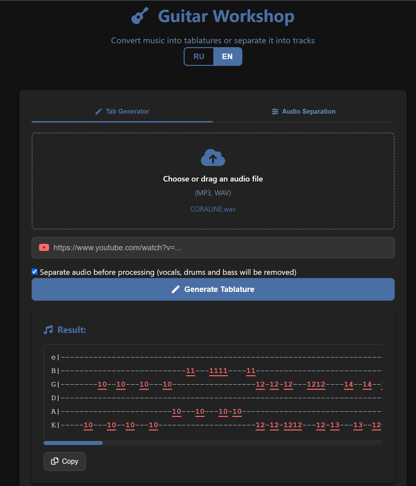
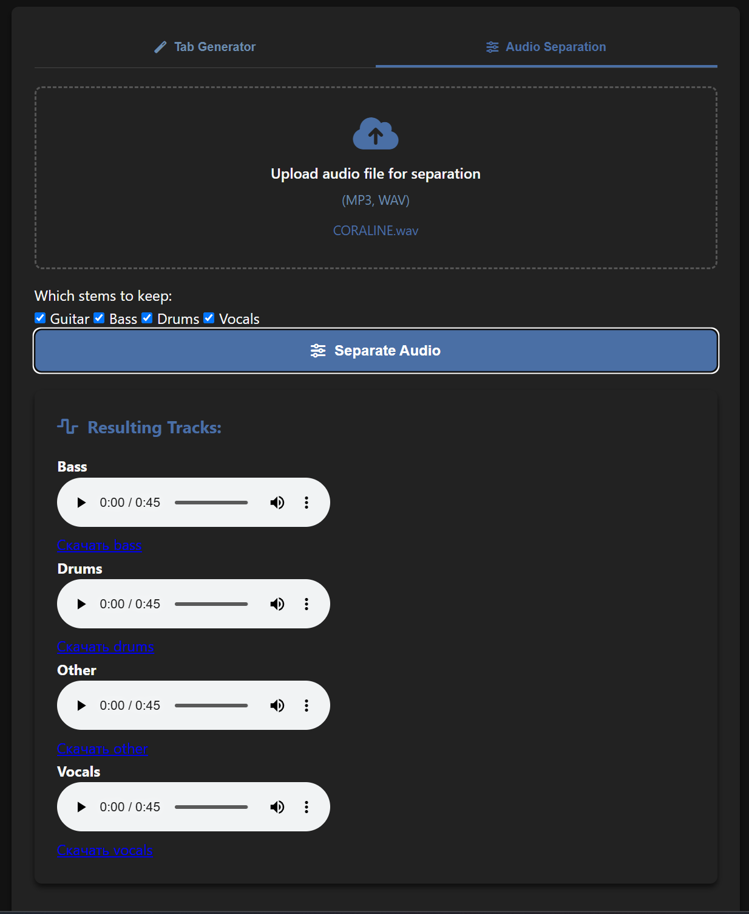

# 🎸 Guitar Workshop


[On russian](./README.ru.md)

**Guitar Workshop** is a microservice-based application written in Go that generates guitar tablatures from audio files. The project includes audio analysis, pitch detection, and generation of readable guitar tabs that can be played by hand.

---

## Features

- 🎵 Upload audio files (WAV/MP3)
- 🎼 Isolate guitar track (source separation)
- 🧠 Extract notes using an ML model ([Basic Pitch](https://github.com/spotify/basic-pitch))
- 🎸 Generate playable guitar tablatures with fingerings
- 🖥️ Web interface to display the generated tabs

---

## Architecture

The project is built with a microservice architecture. All components communicate via **gRPC**.

| Component           | Language | Description                            |
|---------------------|----------|----------------------------------------|
| `api-gateway`       | Go       | Accepts audio input, routes requests   |
| `tab-generator`     | Go       | Generates guitar tabs from notes       |
| `audio-preprocessor`| C++ *(disabled)* | Preprocessing: trim, normalize, filters |
| `audio-separator`   | Python   | Guitar source separation from mix      |
| `note-analyzer`     | Python   | Audio analysis and note extraction     |

---

## Examples

### Tab generation example: *Maneskin — Coraline*

If you play this output on a real guitar, the result sounds quite close to the original.



Full tab (fragment):

```text
e|-----------------------------------------------------------------------------------------------------------------------------------------------------------------------------------------------------------------------------------------------------------------------------------------------------------------------------------------------------------------------------------------------------------------------------
B|---------------------------11---1111----11---------------------------------------------------------11--11-----11----------------------------------------------------------------------------------------------------------------------------------------------------------------------------------------------------8--66-6-666------------------------------------------------------------------------------11-----11--11---
G|--------10--10---10---10------------------12-12-12---1212----14--14--12-12--12---10--10---10--10------------------12-12--12---12--12---14--14--1212--12---1010----1010----15--15---15---15--12---12-12---12--12-----14--1414--12-12--12---10--10---10---10---15--15----15--15--12---12--12-12----12---14--14--12-12------------0-15--15----15--15---12--12---12-----14--14---12---12--12---10---10---1010------------------12
D|------------------------------------------------------------------------------------------------------------------------------------------------------------------------------------------------------------------------------------------------------------------------------------------------------------------------0-0-000----------------------------------------------------------------------------------------------
A|------------------------10---10---10-10---------------------------------------------------------10---10-----10---------------------------------------------------------10---------------------------------------------------------------------------------10-----------------------------------------------------7-7--5-----------------------------------------------------------------------------------10-----10---10---7-
E|-----10---10--10---10---------------------12-12-1212---12-13---13--12---1212---10--10--10---10------------------12---1212--12---12--13---13--12--1212--10---10-10---10------15--15---15---12---12---1212---12--1213---13--1312---1212---10--10--10---10--------15--15----15--12---12--12---12--12--13---13--12---------------------15--15----15---12--12--12-----13---13---12---12--12---10--10---10---10--------------------
```

### Audio separation
Example of isolating the guitar track from a full mix:


# Tab Generation Algorithm
The project uses my own Go library: [guitar](https://github.com/er-davo/guitar), which models the guitar fretboard and fingerings.

1. Each detected note is mapped to all possible fretboard positions (Playable)
2. Dynamic programming is used to find the optimal sequence of fingerings
3. The algorithm minimizes the cost of transitions between notes (taking into account fret span, string switching, finger stretch)