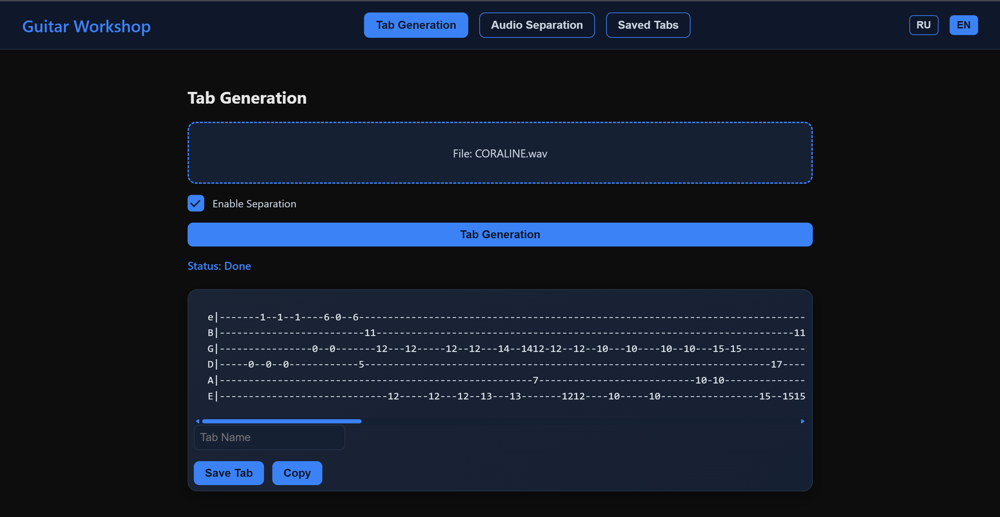
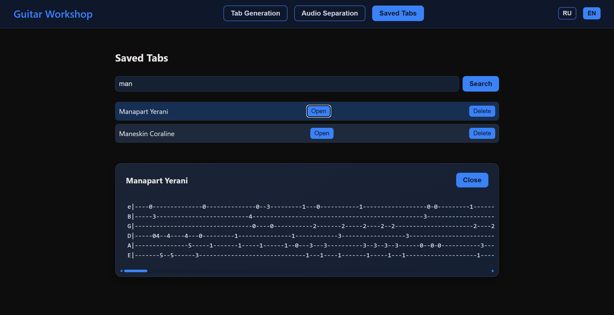
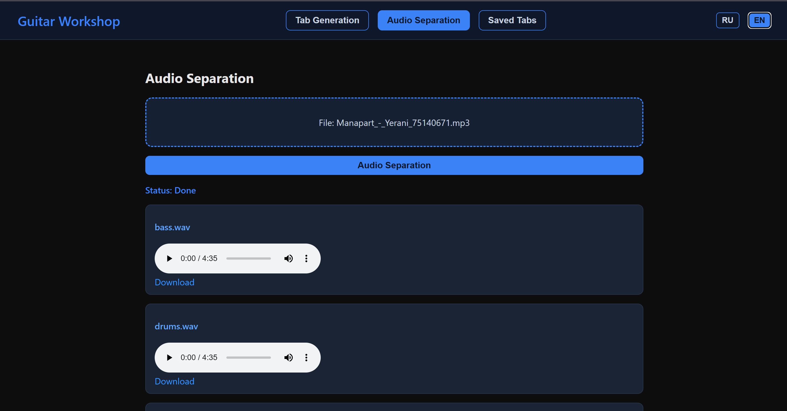
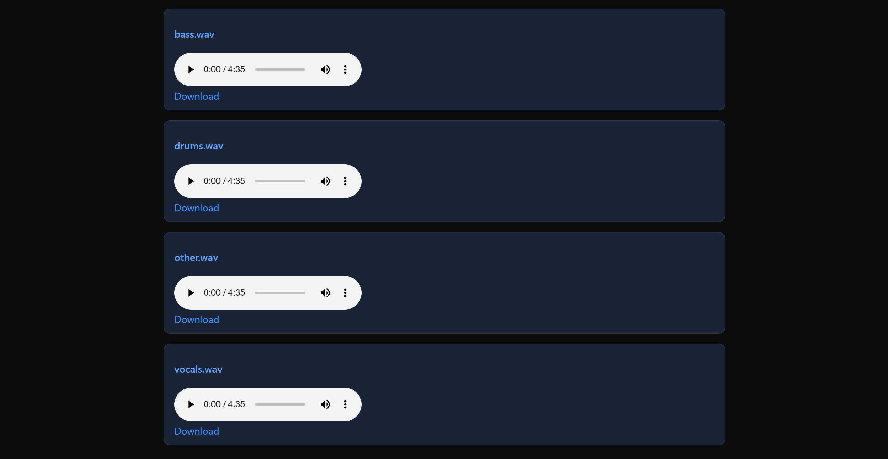

# 🎸 Guitar Workshop

[На русском](README.ru.md)

**Guitar Workshop** is a microservice-based Go application for generating guitar tablatures from audio.

The project includes:

* Asynchronous audio processing
* ML-based note analysis (Basic Pitch)
* Generation of playable guitar tabs with fingerings

Performance (default limits):

* Up to 2 simultaneous audio separation tasks
* Up to 5 simultaneous tab generation tasks (worker pool + semaphore)

Thanks to Kafka and the asynchronous architecture, the application can handle more tasks overall; they may just take longer.
Scalability is easy by increasing the number of workers/semaphores or deploying multiple service replicas (e.g., in Kubernetes) to increase parallel processing.

---

## Features

* Upload audio (WAV/MP3)
* Optional guitar track isolation (source separation)
* Note extraction via ML (Basic Pitch)
* Generate playable guitar tabs with fingerings
* Web interface to display tabs
* Save and search tabs in PostgreSQL
* REST API for managing tabs and tasks
* Fully asynchronous event-driven pipeline via Kafka

---

## Architecture

The project is built with a microservice architecture and an event-driven pipeline. Components communicate via `Kafka` and `gRPC`. `REST API` is provided via `Echo`.

| Component         | Language | Purpose                                                  |
| ----------------- | -------- | -------------------------------------------------------- |
| `api-gateway`     | Go       | REST API, create tasks, check task status                |
| `orchestrator`    | Go       | Coordinates tab generation and audio separation          |
| `tab-generator`   | Go       | Generates tabs, worker pool, gRPC calls to note-analyzer |
| `audio-separator` | Python   | Audio separation with Spleeter, concurrency=2            |
| `note-analyzer`   | Python   | Note extraction (Basic Pitch)                            |
| `PostgreSQL`      | SQL      | Stores tab metadata and task statuses                    |
| `S3`              | —        | Stores audio files and presigned URLs                    |

### Microservice descriptions

* **api-gateway** — REST API; creates tab generation and audio separation tasks; publishes events to Kafka; returns presigned URLs after completion.
* **orchestrator** — consumes events from Kafka; decides when to start tab generation: if audio separation exists — sets task status to `waiting_for_separation`, otherwise publishes `tab.generation.start`.
* **tab-generator** — consumes `tab.generation.start`; uses a worker pool to generate tabs and a semaphore for gRPC calls to note-analyzer; saves tabs to S3 and updates task status.
* **audio-separator** — consumes `audio.separation.start`; performs audio separation via Spleeter with semaphore; publishes `audio.separation.complete`; saves stems to S3.
* **note-analyzer** — extracts notes from audio (Basic Pitch) on request from tab-generator.
* **S3** — stores audio and tabs; presigned URLs are used for secure access.
* **PostgreSQL** — stores metadata and task/tab statuses.

---

## REST API (Echo)

### Tab Management `/tab`

| Method | Endpoint            | Description         |
| ------ | ------------------- | ------------------- |
| GET    | `/tab/search?name=` | Search saved tabs   |
| GET    | `/tab/:id`          | Get saved tab by ID |
| DELETE | `/tab/:id`          | Delete a tab        |

### Tab Generation `/generation`

| Method | Endpoint               | Description                  |
| ------ | ---------------------- | ---------------------------- |
| POST   | `/generation`          | Create a tab generation task |
| GET    | `/generation/:id`      | Get task status              |
| POST   | `/generation/save/:id` | Save a completed tab         |

**POST /generation behavior:**

* Creates a TabGenTask
* If `separation=true`:

  * Creates an AudioSepTask
  * Publishes `audio.separation.start`
* Otherwise, immediately publishes `tab.generation.request`

**GET /generation/:id example:**

```json
{
  "task": {
    "id": "ucrhu9743uj",
    "status": "waiting_for_separation",
  }
}
```

If the task is done:

```json
{
  "task": {
    "id": "ucrhu9743uj",
    "status": "done",
  },
  "tab": {
    "presigned_url": "some url"
  }
}
```

### Audio Separation `/audio/separation`

| Method | Endpoint                | Description                     |
| ------ | ----------------------- | ------------------------------- |
| POST   | `/audio/separation`     | Create an audio separation task |
| GET    | `/audio/separation/:id` | Get task info                   |

**GET /audio/separation/:id example:**

```json
{
  "id": "sep1234",
  "status": "done",
  "separated_aduio_signed_urls": {
      "vocal": "https://s3.example.com/presigned/guitar_sep1234.wav",
      "drum": "https://s3.example.com/presigned/accompaniment_sep1234.wav",
      "bass": "https://s3.example.com/presigned/bass_sep1234.wav",
      "other": "https://s3.example.com/presigned/other_sep1234.wav"
  }
}
```

---

## Async Flow

### Tab generation without separation

```
POST /generation
   ↓ tab.generation.request (Kafka)
orchestrator
   ↓ tab.generation.start (Kafka)
tab-generator (
    worker pool 5,
    semaphore 2 → gRPC note-analyzer
)
   ↓ S3 (tab saved)
```

### Tab generation with separation

```
POST /generation (if separation == true)
   ↓ AudioSepTask (db) → audio.separation.start (Kafka)
audio-separator (semaphore=2)
   ↓ audio.separation.complete (Kafka)
orchestrator
   ↓ tab.generation.start (Kafka)
tab-generator
   ↓ S3 (tab saved)
```

#### Standalone audio separation

```
POST /audio/separation
   ↓ audio.separation.start (Kafka)
audio-separator
   ↓ audio.separation.complete (Kafka)
```

All services use Kafka + presigned URLs, avoiding blocking HTTP operations.

---

## Database Schema

### Tabs

```sql
CREATE TABLE tabs (
    id UUID PRIMARY KEY DEFAULT gen_random_uuid(),
    name TEXT NOT NULL,
    file_path TEXT NOT NULL,
    created_at TIMESTAMP NOT NULL DEFAULT now(),
    deleted_at TIMESTAMP,
    UNIQUE(name)
);
```

### Statuses

```sql
CREATE TYPE status AS ENUM(
    'CREATED',
    'PENDING',
    'WAITING_FOR_SEPARATION',
    'PROCESSING',
    'DONE',
    'FAILED'
);
```

### Audio separation tasks

```sql
CREATE TABLE audio_sep_tasks (
    id UUID PRIMARY KEY DEFAULT gen_random_uuid(),
    status status NOT NULL DEFAULT 'PENDING',
    input_audio_name TEXT NOT NULL,
    separated_dir_name TEXT NOT NULL,
    error TEXT,
    created_at TIMESTAMP NOT NULL DEFAULT now()
);
```

### Tab generation tasks

```sql
CREATE TABLE tab_gen_tasks (
    id UUID PRIMARY KEY DEFAULT gen_random_uuid(),
    audio_sep_task_id UUID REFERENCES audio_sep_tasks(id),
    status status NOT NULL DEFAULT 'PENDING',
    input_audio_name TEXT NOT NULL,
    result_tab_name TEXT,
    saved BOOLEAN NOT NULL DEFAULT FALSE,
    error TEXT,
    created_at TIMESTAMP NOT NULL DEFAULT now()
);
```

---

## Examples

### Tab generation example for *Maneskin - Coraline*

Playing this on a guitar will sound close to the original.


### Searching and viewing saved tabs



### Audio separation




---

# Tab Generation Algorithm

The project uses my Go library [guitar](https://github.com/er-davo/guitar):

1. Each detected note is mapped to possible fretboard positions (`Playable`)
2. Dynamic programming is used to find the optimal sequence of fingerings
3. The algorithm minimizes transition cost between positions (fret movement, string changes, finger stretches)